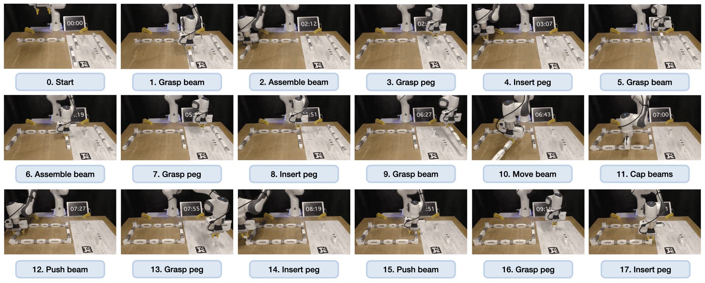

# RAMP: A Benchmark for Evaluating Robotic Assembly Manipulation and Planning
A codebase for baseline to evalute robotic assembly benachmrk.



## Installation Instruction
```
cd ~/catkin_ws/src/
git clone --recursive --branch main git@github.com:junjungoal/ramp.git
cd ramp
git submodule update --init --recursive
```

### Docker Instruction
```
docker build -t assembly_benchmark:latest --build-arg USER=${USER} --build-arg PASSWD=root --build-arg USER_ID=$(id -u) .
docker run -it -d --net=host --gpus all -e HOST_UID=${UID} -e USER=${USER} -e DISPLAY=$DISPLAY -v /tmp/.X11-unix/:/tmp/.X11-unix:rw -v $HOME/.Xauthority:/home/jyamada/.Xauthority:rw  --privileged  --name=assembly_benchmark assembly_benchmark  zsh
docker exec -it assembly_benchmark zsh
```
### High-level planner setup
To setup a high-level planner, please refer to [here](https://github.com/M-A-Robson/MTC_ORI_Collab).

### ROS library installation

```
cd ~/catkin_ws/src

# clone necessary libraries
git clone -b panda_ros_interface --recursive https://github.com/junjungoal/franka_ros
git clone -b melodic-devel https://github.com/junjungoal/panda_moveit_config.git
git clone -b assembly_benchmark https://github.com/junjungoal/apriltag_ros.git
git clone https://github.com/junjungoal/panda_ros_interface.git

# building ROS libraries
rosdep install --from-paths src --ignore-src --rosdistro noetic -r -y --skip-keys libfranka
catkin_make -DCMAKE_BUILD_TYPE=Release -DFranka_DIR:PATH=$HOME/libfranka/build 
source /opt/ros/noetic/setup.zsh
echo 'source /opt/ros/noetic/setup.zsh' >> ~/.zshrc
echo 'source ~/catkin_ws/devel/setup.zsh' >> ~/.zshrc
```


## Example Commands

Run the following commands in different terminal sessions.
```
roslaunch panda_interface robot_bringup.launch  # bring up the robot controller
roslaunch ramp bringup_interface.launch
```

To evaluate the baseline, run 
```
python -m main
```

